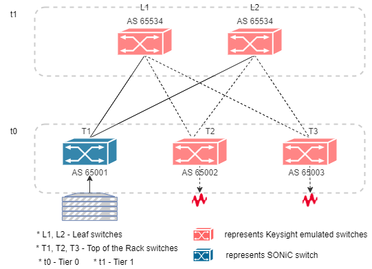
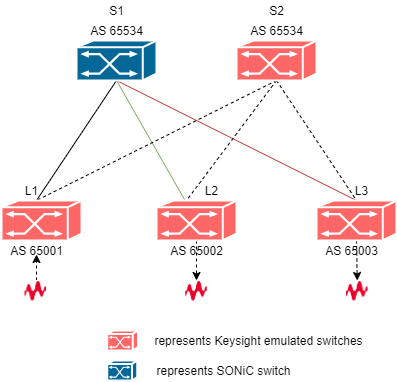
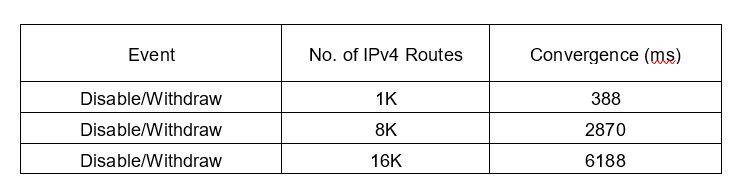

# BGP convergence test plan using single DUT

- [BGP convergence test plan using single DUT](#bgp-convergence-test-plan-using-single-dut)
  - [Overview](#overview)
    - [Scope](#scope)
    - [Testbed](#testbed)
  - [Topology](#topology)
    - [SONiC switch as ToR](#sonic-switch-as-tor)
    - [SONiC switch as Leaf](#sonic-switch-as-leaf)
  - [Setup configuration](#setup-configuration)
  - [Test Methodology](#test-methodology)
  - [Test cases](#test-cases)
    - [Test case # 1 – Convergence performance when remote link fails (route withdraw)](#test-case--1--convergence-performance-when-remote-link-fails-route-withdraw)
      - [Test objective](#test-objective)
      - [Test steps](#test-steps)

## Overview
The purpose of these tests is to test the overall convergence of a data center network by simulating multiple newtork devices such as ToR/Leafs and using SONiC switch DUT as one of the ToR/Leaf, closely resembling production environment. The test assumes all necessary configurations are already pre-configured on the SONiC switch before test runs.

### Scope
These tests are targeted on fully functioning SONiC system. The purpose of these tests are to measure convergence when some unexpected failures such as remote link failure, local link failure, node failure or link faults etc occur and some expected failures such as maintenance or upgrade of devices occur in the SONiC system.

### Testbed
The tests will run on following testbeds:
* t0, t1

## Topology
### SONiC switch as ToR

### SONiC switch as Leaf

## Setup configuration
IPv4 EBGP neighborship will be configured between SONiC DUT and directly connected keysight ports. Keysight ports inturn will simulate the ToR's and Leafs by advertising IPv4/IPv6 routes.

## Test Methodology
RFC 7747 test methodologies will be used for measuring convergence. 
* Keysight IxNetwork web tool will be used to configure ebgp peering between keysight ports and SONiC DUT by advertising IPv4/IPv6 routes. 
* Keysight ports will be advertising the same VIP(virtual IP) addresses. 
* Data traffic will be sent from  server to these VIP addresses. 
* Depending on the test case, the faults will be generated. Local link failures can be simulated on keysight port by "simulating link down" event. 
* Remote link failures can be simulated by withdrawing the routes.
* Control to data plane convergence will be measured by noting down the precise time of the control plane event and the data plane event. Convergence will be measured by taking the difference between contol and data plane events. Keysight IxNework web tool will create those events and provide us with the control to data plane convergence value under statistics.
* RIB-IN Convergence is the time it takes to install the routes in its RIB and then in FIB to forward the traffic without any loss. In order to measure RIB-IN convergence, initially IPv4/IPv6 routes will not be advertised. Once traffic is sent, IPv4/IPv6 routes will be advertised and the timestamp will be noted. Once the traffic received rate goes above the configured threshold value, it will note down the data plane above threshold timestamp. The difference between these two event timestamps will provide us with the RIB-IN convergence value. For this there is no readymamde statistic is available.

## Test cases
### Test case # 1 – Convergence performance when remote link fails (route withdraw)
#### Test objective
Measure the convergence time when remote link failure event happens with in the network.
#### Test steps
* Configure IPv4 EBGP sessions between Keysight ports and the SONiC switch using IxNetwork web UI.
* Advertise IPv4 routes along with AS number via configured IPv4 BGP sessions.
* Configure and advertise same IPv4 routes from both the Keysight ports.
* Configure another IPv4 session to send the traffic. This is the server port from which traffic will be sent to the VIP addresses.
* Start all protocols and verify that IPv4 BGP neighborship is established.
* Create a data traffic between the server port and receiver ports where the same VIP addresses are configured and enable tracking by "Destination Endpoint" and by "Destination session description".
* Set the desired threshold value for receiving traffic. By default it will be set to 95% of expected receiving rate.
* Apply and start the data traffic.
* Verify that traffic is equally distributed between the receiving ports without any loss.
* Simulate remote link failure by withdrawing the routes from one receiving port. 
* Verify that the traffic is re-balanced and use the other available path to route the traffic.
* Drill down by "Destination Endpoint" under traffic statistics to get the control plane to data plane convergence value.
* Set back default configuration.
#### Test results

